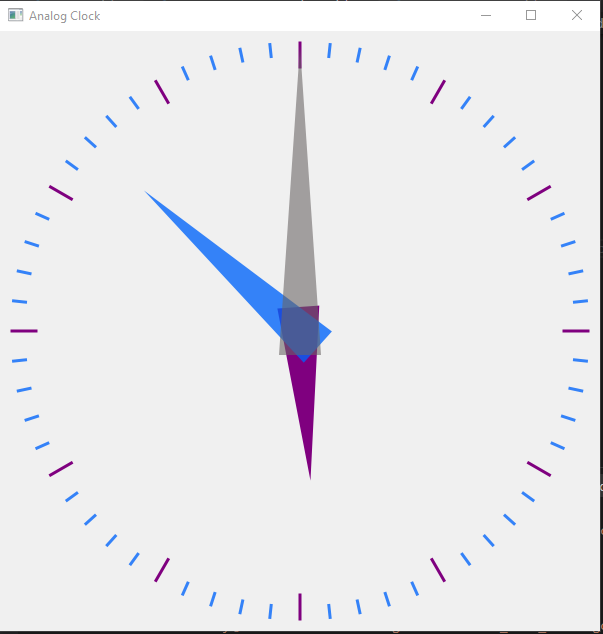

# PyQt5-Second-Hand-Analog-Clock
A simple analog clock design using PyQt5 in Python3.7.4

## This program simply focus on displaying an analog clock using pure Python and PyQt5
Per second the drawing refreshes on the canvas of the clock and in the next second all the clock hands changes their position normally.
This produces a moving clock hand effect.

## Requirements:

- Python3.6+
- PyQt5

## The Clock looks like this:

